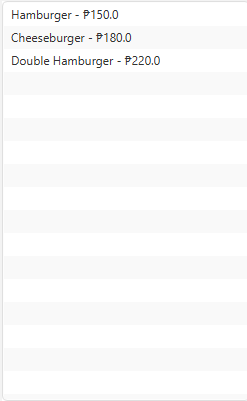
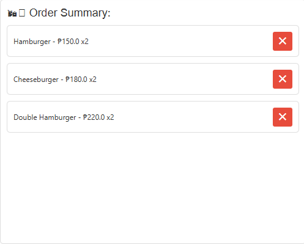

# NIOT Fast Food Ordering App

Welcome to the **NIOT Fast Food Ordering App**, a user-friendly JavaFX application designed to streamline the process of ordering your favorite fast food items. Whether you're craving a juicy hamburger, crispy fried chicken, or a refreshing drink, our app makes it easy to select, customize, and checkout your order seamlessly.

## Table of Contents

- [Features](#features)
- [Screenshots](#screenshots)
- [Installation](#installation)
- [Usage](#usage)
- [Project Structure](#project-structure)
- [Contributing](#contributing)
- [License](#license)

## Features

- **Category Selection**: Browse through different categories such as Burgers, Chicken, and Drinks.
- **Item Selection**: Easily add items to your cart with a single click.
- **Cart Management**: View, update, or remove items from your cart in real-time.
- **Checkout & Receipt**: Generate a detailed receipt with a unique receipt ID and timestamp.
- **Responsive UI**: Intuitive and visually appealing interface built with JavaFX.

## Screenshots

To provide a better understanding of the application's interface and functionality, here are some screenshots:

### 1. Main Interface


*The main screen displays category buttons, item list, and order summary.*

### 2. Adding Items to Cart



*Select items from a category to add them to your cart.*

### 3. Order Summary



*View the items in your cart with options to remove them.*

### 4. Checkout Receipt


*Generate and view a detailed receipt upon checkout.*


## Installation

### Prerequisites

- **Java Development Kit (JDK)**: Ensure you have JDK 8 or higher installed. You can download it from [Oracle](https://www.oracle.com/java/technologies/javase-jdk11-downloads.html) or [OpenJDK](https://openjdk.java.net/).
- **JavaFX SDK**: Download the JavaFX SDK from [Gluon](https://gluonhq.com/products/javafx/).

### Steps

1. **Clone the Repository**

   ```bash
   git clone https://github.com/yourusername/niot-fastfood-app.git
   cd niot-fastfood-app
   ```

2. **Set Up JavaFX**

   - Extract the JavaFX SDK to a desired location on your system.
   - Configure your IDE to include JavaFX libraries. For example, in IntelliJ IDEA:
     - Go to `File` > `Project Structure` > `Libraries`.
     - Click `+` and add the path to the `lib` folder of the JavaFX SDK.

3. **Build and Run the Application**

   - **Using an IDE**:
     - Open the project in your preferred IDE (e.g., IntelliJ IDEA, Eclipse).
     - Ensure that JavaFX is properly configured.
     - Run the `FastFoodApp.java` file.

   - **Using Command Line**:

     ```bash
     javac --module-path /path/to/javafx-sdk-XX/lib --add-modules javafx.controls,javafx.fxml *.java
     java --module-path /path/to/javafx-sdk-XX/lib --add-modules javafx.controls,javafx.fxml FastFoodApp
     ```

     Replace `/path/to/javafx-sdk-XX/lib` with the actual path to your JavaFX SDK's `lib` directory.

## Usage

1. **Launch the Application**: Run the `FastFoodApp` to open the main interface.
2. **Select a Category**: Click on one of the category buttons (Burgers, Chicken, Drinks) to view available items.
3. **Add Items to Cart**: Click on an item from the list to add it to your cart. You can add multiple quantities of the same item.
4. **View Order Summary**: The right panel displays your current cart items. You can remove items by clicking the "X" button next to each item.
5. **Checkout**: Once satisfied with your order, click the "Checkout" button to generate and view your receipt.

## Project Structure

```
niot-fastfood-app/
│
├── src/
│   ├── BurgersCategory.java
│   ├── CartItem.java
│   ├── Checkout.java
│   ├── ChickenCategory.java
│   ├── DrinksCategory.java
│   ├── FastFoodApp.java
│   ├── Item.java
│   └── MenuCategory.java
│
├── screenshots/
│   ├── main_interface.png
│   ├── adding_items.png
│   ├── order_summary.png
│   └── checkout_receipt.png
│
├── README.md
└── pom.xml / build.gradle (if using Maven or Gradle)
```

- **src/**: Contains all Java source files.
- **screenshots/**: Contains images used in the README.
- **README.md**: This documentation file.
- **pom.xml / build.gradle**: Project configuration files for dependency management (if applicable).

## Contributing

Contributions are welcome! If you'd like to enhance the application, please follow these steps:

1. **Fork the Repository**

   Click the "Fork" button at the top right of this repository's page.

2. **Create a Feature Branch**

   ```bash
   git checkout -b feature/YourFeatureName
   ```

3. **Commit Your Changes**

   ```bash
   git commit -m "Add Your Feature"
   ```

4. **Push to the Branch**

   ```bash
   git push origin feature/YourFeatureName
   ```

5. **Open a Pull Request**

   Go to the original repository and click "New Pull Request."

## License

This project is licensed under the [MIT License](LICENSE).

---

Thank you for using the **NIOT Fast Food Ordering App**! If you encounter any issues or have suggestions for improvements, feel free to open an issue or submit a pull request.

# Acknowledgments

- Built with [JavaFX](https://openjfx.io/) for a rich user interface experience.
- Inspired by real-world fast food ordering systems to provide a practical example.

---

*Happy Ordering! 🍔🍗🥤*
